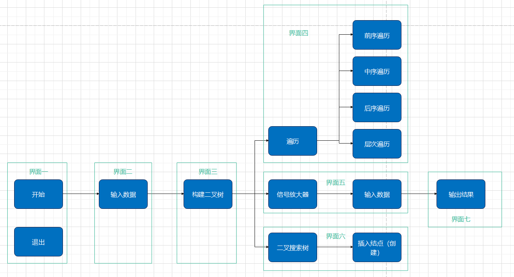
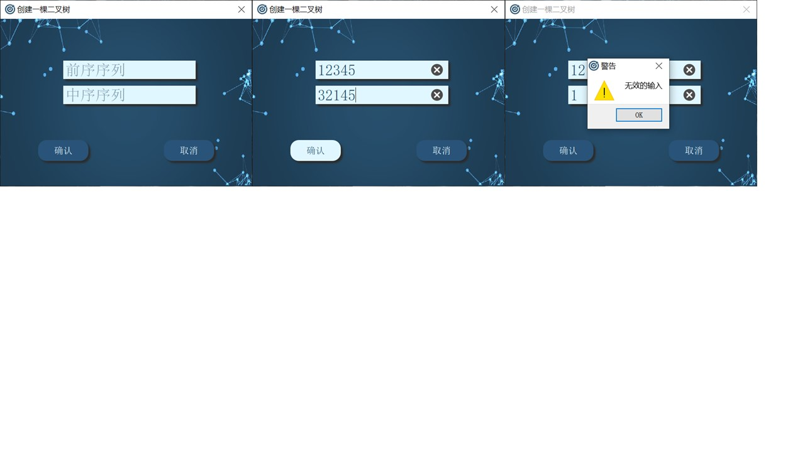
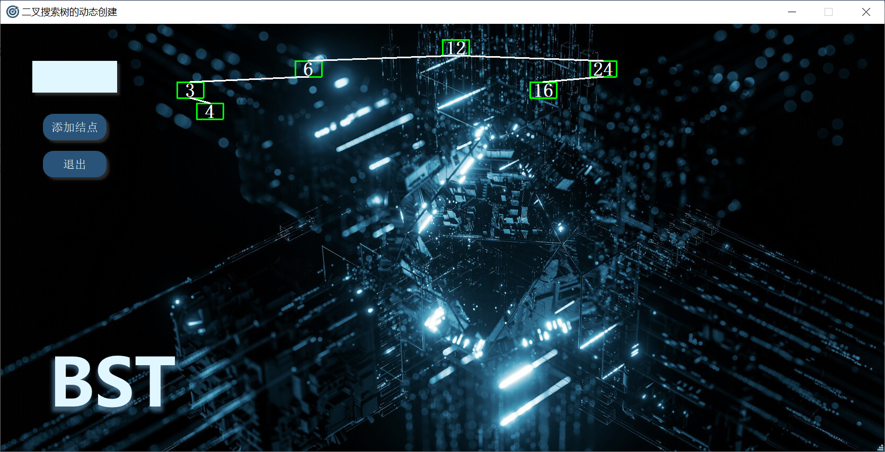

# 二叉树的实现及分析

## 系统目标

在二叉树的实现及分析问题中要实现如下目标：

1. 引导用户进入界面
2. 设计链表结构存储根据用户给定遍历序列生成的二叉树
3. 将链表存储的二叉树可视化
4. 实现二叉树前序、中序、后序、层次四种遍历过程的动态演示
5. 根据用户提供的数据、借助二叉树实现放大器的设置
6. 实现二叉搜索树生成和插入操作的动态可视化
7. 良好的图形界面
8. 简单便捷的操作过程

## 系统定义

本程序有助于用户对于二叉树的生成、存储方式和简单操作具有更加直观和深入的了解，同时能够动态、逐个结点地观察到二叉树的前序遍历、中序遍历、后序遍历和层次遍历；此外为了使用户进一步体会二叉树这种数据结构的作用，本程序还提供了二叉树的应用——信号放大器、二叉树的特例——二叉搜索树。

## 系统边界

1. 能够根据用户输入的数据自动生成二叉树
2. 能够处理非完全二叉树的录入
3. 能够识别用户输入的数据是否为有效数据
4. 能够对用户的操作进行提示
5. 能够由用户控制遍历的进程
6. 能够在当前操作结束后删除使用的二叉树数据并返回开始状态

## 用户视图

1. 开始界面

   用户进入程序的入口界面，由二叉树图标BinaryTree、开始按钮和主题背景构成，同时在点击右上角的关闭按钮后，会弹出关闭确认窗，用户选择确认后就可以关闭整个程序

   

2. 输入序列界面

   用户输入创建二叉树所需的前序、中序序列界面，由前序输入框、中序输入框、确认按钮和取消按钮构成；当用户在输入框输入内容后，也可以选择点击输入框最右端的灰色x号以清除该输入框的内容；同时当用户输入无效的序列时，会弹出输入序列无效警示窗

   

3. 二叉树展示界面

   此界面用于展示生成的二叉树并提供其他功能的入口，由顶部的功能菜单栏和背景上的二叉树构成；背景上的二叉树整体总是居中，但是会根据生成二叉树的结点个数和高度调整二叉树结点的大小

   

4. 二叉树遍历界面（前序、中序、后序、层次）

   此界面用于显示生成二叉树的逐个结点动态遍历，由继续按钮、结束按钮和背景上的二叉树构成；每当遍历到二叉树的一个结点，该结点就会变成绿色；点击继续以遍历下一个结点；点击结束以结束对当前二叉树的遍历

   

5. 信号放大器输入界面

   此界面用于输入设置信号放大器所需的各种数据，由顶部的Amplifier图标、当前结点输入框、父结点输入框、结点类型输入框、结点权值输入框、结点个数显示标签、添加按钮、完成按钮和取消按钮构成；用户每次输入一个结点的数据就点击添加按钮添加结点，此时结点个数显示标签就会显示当前已经添加的结点个数；点击完成按钮弹出容忍值输入框点击取消按钮回到开始界面

   

6. 信号放大器显示界面

   此界面用于展示计算出的信号放大器结点位置，由结点位置标签、确认按钮和退出按钮构成；点击确认按钮删除当前二叉树信号放大器的数据，并返回信号放大器输入界面，可以继续新的信号放大器计算；点击退出按钮返回开始界面

   

7. 二叉搜索树界面

   此界面用于进行以插入节点的方式动态创建二叉搜索树，由右下角的BST图标、右上角的结点输入框、添加结点按钮、退出按钮和背景上的二叉搜索树构成；在输入框内输入结点数据，点击添加结点按钮可以为当前二叉搜索树添加一个新的节点，同时背景上的二叉搜索树结点更新；点击退出按钮返回开始界面

   

   

